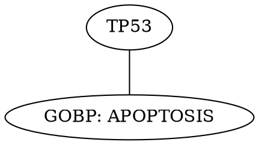

# Command Line Interface (CLI) Documentation

This document describes how to use the Command Line Interface (CLI) for the Gene Set Enrichment Analysis tool.

## Overview

The CLI provides the same core functionality as the Streamlit web application but from the command line, making it ideal for:
- **Automation**: Batch processing of multiple gene lists
- **Server environments**: Running without a graphical interface
- **Integration**: Incorporating into analysis pipelines
- **Reproducibility**: Scriptable analysis workflows

## Quick Start

### Basic Usage

```bash
# Activate virtual environment
source .venv/bin/activate

# Run with example gene list (uses active libraries by default)
python code/cli.py --gene-sets data/gene_lists/example_gene_list.txt

# Run with custom parameters
python code/cli.py \
    --mode iterative \
    --gene-sets my_genes.txt \
    --p-threshold 0.01 \
    --min-overlap 3 \
    --output-dir my_results
```

### Example Script

Use the provided example script to test the CLI:

```bash
# Run the example script
./run_example.sh
```

This will run 5 different examples demonstrating various CLI usage patterns.

## Command Line Options

### Required Parameters

| Option | Short | Description | Default |
|--------|-------|-------------|---------|
| `--gene-sets` | `-g` | Paths to gene set files | Auto-discovers files in `data/gene_lists/` |
| `--background` | `-b` | Path to background gene set file | **all_genes.txt** |
| `--libraries` | `-l` | Paths to gene set library files | **Active libraries from alias.json** |

### Analysis Parameters

| Option | Description | Default | Range |
|--------|-------------|---------|-------|
| `--mode` | Analysis mode: 'regular' or 'iterative' | `regular` | `regular`, `iterative` |
| `--method` | P-value calculation method | `Fisher's Exact Test` | `Fisher's Exact Test`, `Hypergeometric Test`, `Chi-squared Test` |
| `--p-threshold` | Raw p-value threshold for including terms | `0.01` | `1e-10` to `0.5` |
| `--min-overlap` | Minimum overlap size required for terms | `3` | `1` to `∞` |
| `--min-term-size` | Minimum term size | `10` | `1` to `∞` |
| `--max-term-size` | Maximum term size | `600` | `1` to `5000` |
| `--max-iterations` | Maximum iterations for iterative mode | `10` | `0` (no limit) to `500` |

### Output Parameters

| Option | Short | Description | Default |
|--------|-------|-------------|---------|
| `--output-dir` | `-o` | Output directory for results | `cli_results` |

## Usage Examples

### 1. Basic Analysis (Active Libraries)

```bash
# Use active libraries from alias.json with default settings (all_genes.txt background)
python code/cli.py --gene-sets my_genes.txt
```

**What this does:**
- Uses active libraries from alias.json (currently 12 libraries)
- Runs regular enrichment analysis
- Uses default parameters (raw p < 0.01, min overlap = 3)
- Saves results to `cli_results/`

### 2. Regular Enrichment with Specific Libraries

```bash
# Use only specific libraries
python code/cli.py \
    --mode regular \
    --gene-sets my_genes.txt \
    --libraries data/libraries/h.all.v2025.1.Hs.symbols.gmt \
    --libraries data/libraries/c5.go.bp.v2025.1.Hs.symbols.gmt \
    --p-threshold 0.01 \
    --min-overlap 3
```

### 3. Iterative Enrichment

```bash
# Run iterative enrichment with limited iterations
python code/cli.py \
    --mode iterative \
    --gene-sets my_genes.txt \
    --libraries data/libraries/h.all.v2025.1.Hs.symbols.gmt \
    --p-threshold 0.01 \
    --min-overlap 3 \
    --max-iterations 10 \
    --output-dir iterative_results
```

### 4. Custom Statistical Method

```bash
# Use Hypergeometric test with custom parameters
python code/cli.py \
    --mode regular \
    --gene-sets my_genes.txt \
    --method "Hypergeometric Test" \
    --p-threshold 0.05 \
    --min-overlap 2 \
    --min-term-size 5 \
    --max-term-size 500
```

### 5. Multiple Gene Sets

```bash
# Analyze multiple gene lists simultaneously
python code/cli.py \
    --mode regular \
    --gene-sets gene_list1.txt gene_list2.txt gene_list3.txt \
    --libraries data/libraries/h.all.v2025.1.Hs.symbols.gmt \
    --output-dir multi_analysis
```

### 6. High-Throughput Analysis

```bash
# Use active libraries with relaxed parameters for discovery
python code/cli.py \
    --mode regular \
    --gene-sets my_genes.txt \
    --p-threshold 0.1 \
    --min-overlap 1 \
    --min-term-size 5 \
    --max-term-size 1000 \
    --output-dir discovery_analysis
```

## Statistical Parameters

### P-value Threshold

The `--p-threshold` parameter specifies the **raw p-value** threshold for including terms in the results. This is **not** a corrected p-value (e.g., FDR-corrected).

**Important Notes:**
- **Raw p-values** are used for filtering results
- **No multiple testing correction** is applied to the threshold
- **FDR values** are calculated and reported in results but not used for filtering
- **Typical thresholds**: 0.01 (strict), 0.05 (moderate), 0.1 (relaxed)

**Example:**
```bash
# Use raw p < 0.01 for strict filtering
python code/cli.py --gene-sets my_genes.txt --p-threshold 0.01

# Use raw p < 0.1 for discovery analysis
python code/cli.py --gene-sets my_genes.txt --p-threshold 0.1
```

## Input File Formats

### Gene Set Files

Gene set files should contain one gene identifier per line:

```
TP53
BRCA1
BRCA2
CDKN1A
BAX
CASP3
```

**Supported Formats:**
- **Gene Symbols**: Official gene symbols (e.g., TP53, BRCA1)
- **Entrez IDs**: Numeric Entrez IDs (e.g., 7157, 672)

**File Extensions:** `.txt` (recommended)

### Background Gene Set Files

Same format as gene set files, but containing the reference gene list.

### Gene Set Library Files

GMT format files (Gene Matrix Transposed) containing gene sets:

```
TERM_NAME	DESCRIPTION	GENE1	GENE2	GENE3	...
TERM_NAME2	DESCRIPTION2	GENE1	GENE4	GENE5	...
```

**File Extensions:** `.gmt`

## Output Files

**📋 Format Compatibility**: All CLI output files use the exact same format as the Streamlit app, ensuring complete compatibility between command-line and web interface results.

**🕒 Unique Run Folders**: Each CLI run creates a unique timestamped folder (e.g., `gene_set_20250819_143022`) to prevent overwriting previous results and enable easy comparison between different runs.

### Regular Enrichment Output

For each gene set, the CLI creates:

```
output_directory/
└── gene_set_name_YYYYMMDD_HHMMSS/        # Unique timestamped folder for each run
    ├── {library}_regular_results.tsv     # Individual library results
    ├── combined_regular_results.tsv       # All results combined
    └── regular_enrichment_snapshot.json   # Metadata and parameters
```

### Iterative Enrichment Output

```
output_directory/
└── gene_set_name_YYYYMMDD_HHMMSS/        # Unique timestamped folder for each run
    ├── {library}_iterative_results.tsv   # Individual library results (same format as Streamlit)
    ├── combined_iterative_results.tsv     # All results combined (same format as Streamlit)
    ├── combined_network.dot               # Combined network visualization file
    ├── combined_ai_analysis_prompt_enhanced.txt    # Combined enhanced AI analysis prompt
    └── iterative_enrichment_snapshot.json # Metadata and parameters
```

**Iterative TSV Format**: Same columns as regular mode plus:
- `Iteration`: Iteration number (1-based)
- `Genes`: Genes removed in this iteration (comma-separated)

### Output File Formats

#### TSV Results Files

Tab-separated values with columns (same format as Streamlit app):
- `Library`: Source library name
- `Rank`: Result rank (1-based)
- `Term`: Gene set term name (formatted with underscores replaced by spaces)
- `Description`: Term description/URL
- `Overlap size`: Overlap statistics (e.g., "5/100")
- `p-value`: Statistical significance (raw p-value)
- `-log(p-value)`: Negative log10 of p-value
- `FDR`: False discovery rate (if calculated)
- `Genes`: Comma-separated list of overlapping genes

#### JSON Metadata Files

Contains analysis metadata:
```json
{
  "gene_set_name": "example_gene_list",
  "gene_set_size": 300,
  "background_name": "all_genes.txt",
  "background_size": 23391,
  "libraries": ["h.all.v2025.1.Hs.symbols", "c5.go.bp.v2025.1.Hs.symbols"],
  "parameters": {
    "p_value_method": "Fisher's Exact Test",
    "p_threshold": 0.01,
    "min_overlap": 3
  },
  "total_results": 15,
  "timestamp": "2025-08-19T22:15:41.792"
}
```

#### DOT Network Files

Graphviz DOT format for network visualization:


#### AI Analysis Files (Iterative Mode Only)

The CLI generates an AI-optimized format for biological interpretation of the combined network from all libraries:

**Enhanced Prompt Format** (`combined_ai_analysis_prompt_enhanced.txt`):
- Comprehensive biological analysis with detailed instructions
- Pre-processed network statistics and centrality analysis
- Structured biological interpretation guidelines
- Best for comprehensive biological interpretation

This file can be used with AI tools like ChatGPT for biological interpretation of the combined iterative enrichment networks from all processed libraries.

## Performance Considerations

### Gene Set Size Limits

- **Maximum gene set size**: 800 genes per gene set (same as Streamlit UI)
- **Recommended range**: 10-500 genes for optimal performance
- **Large gene sets** (>500 genes): May take longer to process and use more memory

### Processing Time

| Libraries | Gene Set Size | Mode | Approximate Time |
|-----------|---------------|------|------------------|
| 1-2 | 100-500 | Regular | 30 seconds - 2 minutes |
| All (35+) | 100-500 | Regular | 10-15 minutes |
| 1-2 | 100-500 | Iterative | 1-5 minutes |
| All (35+) | 100-500 | Iterative | 30-60 minutes |

### Memory Usage

- **Small gene sets** (< 100 genes): ~500MB RAM
- **Large gene sets** (800+ genes): ~1-2GB RAM
- **All available libraries**: Additional ~500MB RAM

### Optimization Tips

1. **Use specific libraries** instead of active libraries for faster processing
2. **Limit iterations** in iterative mode (e.g., `--max-iterations 5`)
3. **Adjust term size filters** to reduce processing load
4. **Use relaxed p-thresholds** for initial screening

## Troubleshooting

### Common Issues

#### 1. "No gene set files found"

**Problem:** CLI can't find gene set files
**Solution:**
```bash
# Specify file path explicitly
python code/cli.py --gene-sets /full/path/to/my_genes.txt

# Or place files in data/gene_lists/
cp my_genes.txt data/gene_lists/
python code/cli.py --gene-sets data/gene_lists/my_genes.txt
```

#### 2. "No library files found"

**Problem:** CLI can't find library files
**Solution:**
```bash
# Check if libraries exist
ls data/libraries/*.gmt

# Specify library paths explicitly
python code/cli.py --gene-sets my_genes.txt --libraries data/libraries/h.all.v2025.1.Hs.symbols.gmt
```

#### 3. "Virtual environment not activated"

**Problem:** Missing dependencies
**Solution:**
```bash
# Activate virtual environment
source .venv/bin/activate

# Verify installation
python code/cli.py --help
```

#### 4. "No results obtained"

**Problem:** No significant enrichments found
**Solutions:**
```bash
# Relax parameters
python code/cli.py --gene-sets my_genes.txt --p-threshold 0.1 --min-overlap 1

# Check gene set size
wc -l my_genes.txt

# Verify gene format (symbols vs Entrez IDs)
head -10 my_genes.txt
```

#### 5. "Memory error"

**Problem:** Insufficient memory for large analysis
**Solutions:**
```bash
# Use fewer libraries
python code/cli.py --gene-sets my_genes.txt --libraries data/libraries/h.all.v2025.1.Hs.symbols.gmt

# Reduce gene set size (max 800 genes)
head -800 my_genes.txt > my_genes_limited.txt
python code/cli.py --gene-sets my_genes_limited.txt
```

#### 6. "Gene list too large"

**Problem:** Gene set exceeds 800 gene limit
**Solution:**
```bash
# Reduce gene set to 800 genes or fewer
head -800 my_genes.txt > my_genes_limited.txt
python code/cli.py --gene-sets my_genes_limited.txt
```

### Error Messages

| Error | Meaning | Solution |
|-------|---------|----------|
| `Error: Gene sets and libraries cannot be empty` | No input files found | Check file paths and existence |
| `Error: Mode must be 'regular' or 'iterative'` | Invalid mode specified | Use `--mode regular` or `--mode iterative` |
| `Error: No results directory found` | Output directory creation failed | Check permissions and disk space |
| `Error: Gene list too large!` | Gene set exceeds 800 gene limit | Reduce gene set to 800 genes or fewer |
| `Warning: X symbols not found in database` | Some genes not recognized | Check gene format and spelling |

## Integration Examples

### Batch Processing Script

```bash
#!/bin/bash
# Process multiple gene lists

for gene_file in gene_lists/*.txt; do
    echo "Processing $gene_file..."
    python code/cli.py \
        --gene-sets "$gene_file" \
        --output-dir "results/$(basename "$gene_file" .txt)"
done
```

### Python Integration

```python
import subprocess
import json

def run_enrichment(gene_file, output_dir):
    cmd = [
        "python", "code/cli.py",
        "--gene-sets", gene_file,
        "--output-dir", output_dir,
        "--mode", "regular",
        "--p-threshold", "0.01"
    ]
    
    result = subprocess.run(cmd, capture_output=True, text=True)
    
    if result.returncode == 0:
        # Load results
        with open(f"{output_dir}/regular_enrichment_snapshot.json") as f:
            metadata = json.load(f)
        return metadata
    else:
        raise Exception(f"CLI failed: {result.stderr}")
```

### R Integration

```r
# Run CLI from R
run_enrichment <- function(gene_file, output_dir) {
  cmd <- paste(
    "python code/cli.py",
    "--gene-sets", gene_file,
    "--output-dir", output_dir,
    "--mode regular",
    "--p-threshold 0.01"
  )
  
  system(cmd)
  
  # Read results
  results <- read.delim(
    file.path(output_dir, "combined_regular_results.tsv"),
    sep = "\t"
  )
  
  return(results)
}
```

## Best Practices

### 1. File Organization

```
project/
├── gene_lists/
│   ├── my_genes.txt
│   └── control_genes.txt
├── results/
│   ├── analysis1/
│   └── analysis2/
└── scripts/
    └── run_analysis.sh
```

### 2. Parameter Selection

- **Discovery**: Use relaxed parameters (`p < 0.1`, `min_overlap = 1`)
- **Validation**: Use strict parameters (`p < 0.01`, `min_overlap = 3`)
- **Screening**: Use active libraries for comprehensive coverage
- **Focus**: Use specific libraries for targeted analysis

### 3. Output Management

- Use timestamped output directories
- Keep metadata files for reproducibility
- Archive old results
- Use descriptive directory names

### 4. Performance Optimization

- Start with small gene sets for testing
- Use specific libraries for faster processing
- Monitor memory usage for large analyses
- Consider parallel processing for multiple gene sets

## Support

For additional help:

1. **Check help**: `python code/cli.py --help`
2. **Run examples**: `./run_example.sh`
3. **Review logs**: Check console output for detailed information
4. **Validate inputs**: Ensure gene files are properly formatted

The CLI provides powerful command-line access to the same enrichment analysis capabilities as the web interface, enabling automation and integration into larger analysis workflows.
